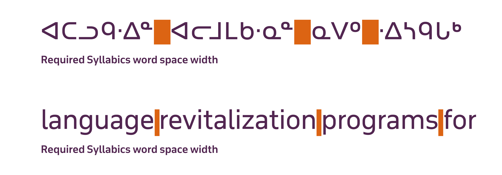

# Syllabics Knowledge
The purpose of this repository is to provide resources to those interested in developing Canadian Syllabics typefaces for the various Indigneous communities in North America that use this writing system.
 
 
 

## 📖 [Syllabics typographic guidelines and local typographic preferences](https://www.typotheque.com/articles/syllabics_typographic_guidelines)

In order to work on font development for the Canadian Syllabics, it is important to become acquainted with the behaviours and concepts that are inherently unique to this writing system. The above article has been prepared to outline these concepts that are unique to the Syllabics, and is a good starting point towards understanding the terminology and concepts provided within these development materials. It is also a useful article for understanding how to look at the encoding of the Syllabics in the Unicode Standard ("UCAS", Unified Canadian Aboriginal Syllabics), to understand how Unicode encodes and represents the Syllabics, how this differs from various local Syllabics-using Indigenous communities. This helps to provide context for necessary solutions that may be required in Syllabics font development for providing support for local typographic variations within specific communities. 

For a better understanding of how to view the Syllabics within their seaparate typographic traditions and local typographic and encoding preferences, [please see section two]
 
 
 

## Recommendations for Syllabics typeface development

The following sections provide an overview of the local typographic preferences and orthographic requirements for each individual Indigenous language community that uses the Syllabics, with the purpose of typeface design and development in mind. For each community, their local Syllabics preferences have been presented graphically in the form of their Syllabics orthography chart, accompanied by footnotes were necessary beneath the chart. 

Below these charts is a subset of the required glyph set for each community. In these subsets, please note that the glyph representations will in some cases differ from the graphical representation in the orthography charts above. This is expected, as UCAS harmonizes many of the Syllabics orthographies into one unified set, although a much greater diversity of glyph representations exists within the scope of Syllabics communities. These subsets are useful for developing typefaces for specific Indigenous language communities, where one may not need to cover the entire UCAS encoding range, which is quite large.

Furthermore, each section contains any relevant notes that may be applicable towards accommodating specific local typographic preferences and variations, or issues surrounding encoding preferences for each community, and suggestions towards implementation in a given Syllabics typeface.
 
 
 

## Syllabics Glyph Set

## General Syllabics Variant Glyphs
The Syllabics share the word space, punctuation, and numeral glyphs with the Latin script, but require local variations to accommodate the inherent proportions of the writing system in order to maintain readability and legibility for users across all communities.

###### Syllabics word space
The Syllabics must have a word space glyph that is significantly wider than the Latin Script, by comparison:

This is essential and non-negotiable in order for Syllabics texts to remain legible and readable. If Syllabics texts use a Latin script width word space, the very narrow Latin space (in comparison to the wide internal counter structures of the Syllabics), the word images within a given sentence or paragraph of text will be undistinguishable. 

The Syllabics by default uses the word space glyph `U+0020`, shared with many other writing systems. It is possible to implement a wider word space glyph to accommodate the Syllabics through rendering `U+0020` at an appropriate glyph width value for this system, but it will then produce a word space far too wide for the Latin script. One could provide a Syllabics-specific typeface that renders the deafult word space at the Syllabics required width, and then provides a separate Latin script font with an appropriate, narrower glyph width. Alternatively, the Syllabics and Latin-specific word space glyphs could be mapped to stylistic sets which could be used for script-specific typesetting.
 
 

###### Syllabics numerals 
 
 

###### Syllabics punctuation
 
 

## Notes on Syllabics Kerning
Within this repository you will find a .csv document that provides Syllabics kerning pairs and suggested classes for implementing into Syllabics typefaces. Within the context of Syllabics typography, kerning has very rarely, if ever, been implemented, although it's effect is quite dramatic on the legibility and readability of Syllabics texts across all user communities. The kerning pairs and classes are suggested, and kerning tables for a given Syllabics font implementation should take into consideration the direct requirements of each specific community and their language patterns.

 
 
 

## ᐊᓂᐦᔑᓈᐯᒧᐎᓐ / Anishinaabemowin (Ojibway)
Although all Ojibway language communities could use Syllabics to accurately represent their languages, it is important to note that not all Ojibway communtiies use this writing system. It is particularly the communities of northern Ontario and western Ojibway dialect speakers of Manitoba and Saskatchewan that have a current use of Syllabics. All other communities use a number of roman orthography systems to write their local dialects, including Algonquin, Odawa, Eastern Ojibwe, and Central Ojibwe. There is a relatively high degree of variation in the local typographic and orthographic preferences for Ojibway Syllabics between communities, particularly for communities in northern Ontario. This is particularly evident in northern Ontario communities, and can be seen primarily in the form and orientation of finals characters and their vertical positioning. The following chart shows the preferred representation of the Ojibway Syllabics orthography:

❶ A major distinction towards local typographic preferences amongst Northern Ontario Ojibwe communities is in the preferred form or orientation of finals characters. This is notably the difference between Western and Eastern Cree finals forms, and the i-pos and a-pos orientation scheme of finals glyphs. This can vary between communities, and between users within the same community. Some northern Ontario Ojibwe communities may follow the form of the Western Cree finals shapes, while others the Eastern Cree. For those who use the Eastern Cree finals forms, they may follow either the `a vowel (ᐊ ᐸ ᑲ ᓇ)` position or `i vowel (ᐃ ᐱ ᑭ ᓂ)` position orientation, a convention unique to Ontario Ojibwe Syllabics. There can also be mixing of these two orientation positions within the same text. Unicode encodes both the `a` and `i` position finals orientations to accommodate these preferences.

❷ Note that there is a local preference for a horizontally-centered `n final (ᓐ)` for some Northwestern Ojibwe communities.

❸ Note that this small ring character `U+18DE (ᣞ)` is often depicted as a raised glyph, sitting above the top line in some common, system-level Syllabics typefaces. This is a finals character and should be vertically positioned and drawn to work in harmony with the other finals glyphs, as in the example below:

This glyph is used in several other Algonquian Syllabics using languages, and should appear in the same manner for all language communities.

❹ There is variation in the preferred positioning of the `w dot` in relation to the syllabic that it is modifying. Traditionally, Western Cree and Ojibwe communities place the w-dot to the right of the base syllabic, while Eastern Cree and Ojibwe communities will place the dot to the left of the syllabic, to lead the base character it is modifying. There is variation within 

There is also variation in how this dot is encoded in texts between communities and individual users within communities. Some users will encode the `w dot` as two distinct code points: `U+1427 FINAL MIDDLE DOT (ᐧ)` plus the base syllabic glyph (`ᐧ` + `ᐃ` = `ᐧᐃ`). Others will encode these sequences of `w dot` with the pre-composed base glyphs within UCAS, where `w dot` and the base syllabic are treated as a composite glyph (`ᐎ`, `ᐗ`).
 

###### Ojibway Syllabics Subset
`ᐧ ᐁ    ᐃ    ᐅ    ᐊ    ᐄ    ᐆ    ᐋ ᐯ    ᐱ    ᐳ    ᐸ    ᐲ    ᐴ    ᐹ ᑌ    ᑎ    ᑐ    ᑕ    ᑏ    ᑑ    ᑖ ᑫ    ᑭ    ᑯ    ᑲ    ᑮ    ᑰ    ᑳ ᒉ    ᒋ    ᒍ    ᒐ    ᒌ    ᒎ    ᒑ ᒣ    ᒥ    ᒧ    ᒪ    ᒦ    ᒨ    ᒫ ᓀ    ᓂ    ᓄ    ᓇ    ᓃ    ᓅ    ᓈ ᓭ    ᓯ    ᓱ    ᓴ    ᓰ    ᓲ    ᓵ ᔐ    ᔑ    ᔓ    ᔕ    ᔒ    ᔔ    ᔖ ᔦ    ᔨ    ᔪ    ᔭ    ᔩ    ᔫ    ᔮ ᕓ    ᕕ    ᕖ    ᕗ    ᕘ    ᕙ    ᕚ ᕞ    ᕠ    ᕢ    ᕤ    ᕥ    ᕦ    ᕧ ᐎ ᐄ ᐐ    ᐆ ᐕ ᐓ ᐗ    ᐋ ᐙ ᑊ    ᑉ    ᣔ    ᐟ    ᑦ    ᣕ ᐠ    ᒃ    ᣖ ᐨ    ᒡ    ᣗ    ᒻ    ᣘ ᐣ    ᓐ    ᣙ    ᐢ    ᔅ    ᣚ     ᐡ    ᔥ    ᣛ    ˚    ᔾ     ᕝ    ᕪ ᐤ ᣜ    ᣝ ᓫ    ᕑ ᐦ    ᐞ
` 
 
 
 

## ᐊᓂᐦᔑᓂᓃᒧᐏᐣ (Anishininiimowin) (Oji-Cree)

Orthographically and typographically speaking, Oji-Cree follows the same general pattern as Western Cree and Ojibwe Syllabics: `w dot` positioned to the right, following the syllabic, and employing the Western Cree finals forms. The difference from Cree being that Oji-Cree requires the `sh series (ᔐ ᔑ ᔓ ᔕ)` in its orthography. Additionally, Oji-Cree may use Latin script full stop and hyphen in contemporary texts, rather than the local Syllabics characters.

❶ While variation exists within Northwestern Ojibway communities in regards to the positioning of the `w dot` between users in contemporary texts, Oji-Cree users always follow the Western Cree convention of placing `w dot` to the right of the modified base syllabic.

There is variation, though, in how `w dot` is encoded in texts between communities and individual users within Oji-Cree communities. As in Northern Ojibway communities, users may encode the `w dot` as two distinct code points: `U+1427 FINAL MIDDLE DOT (ᐧ)` plus the base syllabic glyph (`ᐧ` + `ᐃ` = `ᐧᐃ`). For an example of this encoding practice, see [ᐧᐊᐧᐊᑌ ᐊᒋᒧᐧᐃᓇᐣ / Wawatay News](https://wawataynews.ca/list-newspaper). Others may encode `w dot` sequences with the pre-composed base glyphs within UCAS, where `w dot` and the base syllabic are treated as a composite glyph (`ᐎ`, `ᐗ`).
 

###### Oji-Cree Syllabics Subset
`ᐧ ᐁ ᐃ ᐅ ᐊ ᐄ ᐆ ᐋ ᐌ ᐎ ᐒ ᐗ ᐧᐄ ᐧᐆ ᐧᐋ ᐯ ᐱ ᐳ ᐸ ᐲ ᐴ ᐹ ᑌ ᑎ ᑐ ᑕ ᑏ ᑑ ᑖ ᑫ ᑭ ᑯ ᑲ ᑮ ᑰ ᑳ ᒉ ᒋ ᒍ ᒐ ᒌ ᒎ ᒑ ᒣ ᒥ ᒧ ᒪ ᒦ ᒨ ᒫ ᓀ ᓂ ᓄ ᓇ ᓃ ᓅ ᓈ ᓭ ᓯ ᓱ ᓴ ᓰ ᓲ ᓵ ᔐ ᔑ ᔓ ᔕ ᔒ ᔔ ᔖ ᔦ ᔨ ᔪ ᔭ ᔩ ᔫ ᔮ ᐤ ᑊ ᐟ ᐠ ᐨ ᒼ ᐣ ᐢ ᐡ ᔾ ᓬ ᕒ ᐦ ᐀ ᙮ - .`

 
 
 

## ᓇᐦᑲᐌᒧᐎᐣ (Nakawêmowin) (Western Ojibwe)
Western Ojibwe is the dialect of Ojibwe spoken by the communities west of Ontario. As a result of their proximity to neighbouring Western Cree communities, the orthographic and typographic conventions tend to follow verry closely that of the Plains and Western Swampy Cree Syllabics, where `w dot` is positioned right of the base syllabic. Note that Western Ojibwe requires the `sh series (ᔐ ᔑ ᔓ ᔕ)` in it's orthographic repertoire – as does Oji-Cree – not needed in the Cree language orthographies.

❶ While Western Ojibwe typically follows the style Round form style of Syllabics, consistent with other Western Cree communities, it is possible that users prefer to have the glyphs `ᔓ` and `ᔕ` represented in the Square form style, while Eastern Ojibwe and Cree communities would represent this glyph in the Round form style, illustrated below:

###### Western Ojibwe Syllabics Subset
`ᐧ ᐁ ᐃ ᐅ ᐊ ᐄ ᐆ ᐋ ᐯ ᐱ ᐳ ᐸ ᐲ ᐴ ᐹ ᑌ ᑎ ᑐ ᑕ ᑏ ᑑ ᑖ ᑫ ᑭ ᑯ ᑲ ᑮ ᑰ ᑳ ᒉ ᒋ ᒍ ᒐ ᒌ ᒎ ᒑ ᒣ ᒥ ᒧ ᒪ ᒦ ᒨ ᒫ ᓀ ᓂ ᓄ ᓇ ᓃ ᓅ ᓈ ᓭ ᓯ ᓱ ᓴ ᓰ ᓲ ᓵ ᔐ ᔑ ᔓ ᔕ ᔒ ᔔ ᔖ ᔦ ᔨ ᔪ ᔭ ᔩ ᔫ ᔮ ᐧᐁ ᐧᐃ ᐧᐅ ᐧᐊ ᐧᐄ ᐧᐆ ᐧᐋ ᑊ ᐟ ᐠ ᐨ ᒼ ᐣ ᐢ ᐡ ᕀ ᐤ ᓬ ᕒ ᐦ ᕁ ᐀ ᙮ - .`

 
 
 

## ᓱᖽᐧᖿ (Siksiká) (Blackfoot) *** historical ***

The historical Blackfoot Syllabics encoded in UCAS are no longer in use by the community. This system of writing the Blackfoot language was developed in 1888 by John William Timms, although it never gained traction with the local language communities. Instead, Blackfoot has been written using a standardized roman orthography for over a century, although there have been recent efforts to develop a new Syllabics orthography for the Blackfoot language, which is distinct from this writing system.

❶ The primary distinction that one would notice regarding the graphic representation of the historical Blackfoot Syllabics is the use of the Square Form style, which is consistent with the common form of Syllabics used in Western Canada for the Dene Syllabics. As well, some Plains and Woods Cree communities also used the Square Form style historically, in the late 19th century. As a result of proximity and the sharing of type material, the historical Blackfoot Syllabics featured this stylistic form, which would be seen in glyphs such as `ᑫ ᑭ ᑯ ᑲ` `ᓭ ᓯ ᓱ ᓴ` `ᔦ ᔨ ᔪ ᔭ`.
 

###### Blackfoot Syllabics Subset
` ᖳ ᖰ ᖱ ᖲ ᑫ ᑭ ᑯ ᑲ ᒣ ᒥ ᒧ ᒪ ᖿ ᖼ ᖽ ᖾ ᒉ ᒋ ᒍ ᒐ ᖻ ᖸ ᖹ ᖺ ᓭ ᓯ ᓱ ᓴ ᔦ ᔨ ᔪ ᔭ ᖷ ᖴ ᖵ ᖶ ᐤ  ᐨ  ᘁ  ᐢ  ᐡ  ᔈ ᐧ ᐟ ᑉ ᐠ ᙿ ᑊ  ᐦ ᐀ ᙮ - .`

 
 
 

## ᓀᐦᐃᔭᐍᐏᐣ (nêhiyawêwin) (Plains Cree)

Plains Cree communities comprise the largest group of speakers who use Syllabics as their primary and preferred writing system, and have a long and vibrant use of Syllabics. Plains Cree Syllabics follow the Round form style, although historically, the Square form style would have also been employed in 19th century and early-to-mid 20th century texts. Note that Plains Cree communities may use the Syllabics hyphen `U+1400 (᐀) CANADIAN SYLLABICS HYPHEN and the Syllabics full stop `U+166E (᙮) CANADIAN SYLLABICS FULL STOP`, or, the Latin script representations and encoding for these characters.

❶ Plains Cree Syllabics users may encode `w dot` using may encode the `w dot` as `U+1427 FINAL MIDDLE DOT (ᐧ)` plus the base syllabic glyph (`ᐧ` + `ᐃ` = `ᐧᐃ`) or with the pre-composed base glyphs within UCAS, where `w dot` and the base syllabic are treated as a composite glyph (`ᐎ`, `ᐗ`).

❷ Although some system-level Syllabics typefaces and historical texts have represented `U+1425 (ᐤ) CANADIAN SYLLABICS FINAL RING` at horizontally centered at the mid line, contemporary texts and communities show the preference for this glyph to be vertically positioned at the top line, consistent with the positioning of all other finals.

❸ There is variation within Plains Cree communities in terms of the representation of the `y series` final character and how it transforms when paired with the `w dot`. The common form of this in Plains Cree is a plus mark `U+1429 (ᐩ)`; however, some communities prefer to use a superposed dot mark `U+141D (ᐝ)`, which is graphically distinct from the common `y final`. It should be noted that this alternative `y final` form (see example 2 in the below image) should be represented as a combination of a closed `w dot mark` on the bottom, and an open, small ring character at the top, rather than two open ring characters, as is shown in some general, system-level typefaces:

There is also variety in the way that the `y final` transforms when it preceeds the `w dot` modifier. The general w + y final sequence is represented by two inline characters, `U+1427 (ᐧ)` + `U+1429 (ᐩ)`. In some communities, this sequence is preferred to be graphically represented by a combination of two stacked `w dot` marks, with the lower dot taking the same position as `w dot`, and the second dot, above, positioned at the top line:

This alternative combination is not encoded in Unicode, and must be implemented in any given Syllabics typeface as an alternative glyph, and mapped in a way that agrees with the input method of the client or community members who will use the typeface.
 

###### Plains Cree Syllabics Subset
`ᐧ ᐁ ᐃ ᐄ ᐅ ᐆ ᐊ ᐋ ᐍ ᐏ ᐑ ᐓ ᐕ ᐘ ᐚ ᐯ ᐱ ᐲ ᐳ ᐴ ᐸ ᐹ ᑌ ᑎ ᑏ ᑐ ᑑ ᑕ ᑖ ᑫ ᑭ ᑮ ᑯ ᑰ ᑲ ᑳ ᒉ ᒋ ᒌ ᒍ ᒎ ᒐ ᒑ ᒉ ᒋ ᒌ ᒍ ᒎ ᒐ ᒑ ᓀ ᓂ ᓃ ᓄ ᓅ ᓇ ᓈ ᓭ ᓯ ᓰ ᓱ ᓲ ᓴ ᓵ ᔦ ᔨ ᔩ ᔪ ᔫ ᔭ ᔮ ᐧ  ᐤ  ᑊ  ᐟ  ᐠ  ᐨ  ᐨ  ᐣ  ᐢ  ᐩ  ᓬ  ᕒ  ᐦ  ᕁ  ᐝ ᛬ ᐀ ᙮`

 
 
 

## ᓀᐦᐃᖬᐍᐏᐣ (nīhithawīwin) (Woods Cree)
Woods Cree communities have a strong preference for using Syllabics as their primary writing system and, as in Plains Cree communities, have long history of Syllabics use. The Woods Cree Syllabics typically follow the standard Syllabics glyph representations of the Round form style, and there are no outstanding local typographic or encoding preferences that require accommodating.

###### Woods Cree Syllabics Subset
`ᐧ ᐁ ᐃ ᐅ ᐆ ᐊ ᐋ ᐁᐧ ᐃᐧ ᐅᐧ ᐆᐧ ᐊᐧ ᐋᐧ ᐯ ᐱ ᐳ ᐴ ᐸ ᐹ ᑌ ᑎ ᑐ ᑑ ᑕ ᑖ ᑫ ᑭ ᑯ ᑰ ᑲ ᑳ ᒉ ᒋ ᒍ ᒎ ᒐ ᒑ ᒣ ᒥ ᒧ ᒨ ᒪ ᒫ ᓀ ᓂ ᓄ ᓅ ᓇ ᓈ ᓭ ᓯ ᓱ ᓲ ᓴ ᓵ ᔦ ᔨ ᔪ ᔫ ᔭ ᔮ ᖧ ᖨ ᖪ ᖫ ᖬ ᖭ ᐤ ᑊ ᐟ ᐠ ᐨ ᒼ ᐣ ᐢ ᕀ ᙾ ᓬ ᕒ ᐦ ᕁ ᐀ ᙮`

 
 
 

## ᐃᓂᓂᐎ ᐃᔑᑭᔗᐎᐣ (Ininiwi-Išikišwêwin) (Eastern Swampy Cree)
The Swampy Cree dialect of the larger Cree-Montagnais-Naskapi dialect continuum is broken into two groups: Eastern Swampy Cree, spoken in northern Ontario, and Western Swampy Cree, spoken in Northern Manitoba. Both of these dialects use Syllabics as a primary means of writing their languages, and they typically follow the standardized Syllabics glyph representations found in Unicode, mainly that of the Round form style. Eastern Swampy Cree mixes Eastern and Western Cree Syllabics conventions in a similar way as Oji-Cree, where it uses Western Cree finals characters, and the Eastern Cree practice of placing the `w dot` to the left of the base syllabic that it is modifying.

❶ Note that Eastern Swampy Cree places the `w dot` mark to the left of the base syllabic it modifies, as in the above chart representation. There may be variation in how the `w dot` is encoded (see Ojibway, Oji-Cree Syllabics, above), however, it is important to provide support for the pre-composed characters provided in Unicode that position the dot to the left of the syllabic, as some users may encode their texts this way.

❷ The only major graphical difference between Eastern and Western Swampy Cree is in an alternative form for the `y final (ᔾ)`. The standard form for the `y final` in Eastern Swampy Cree is U+153E (ᔾ), which is the only finals character that deviatives from the Western Cree finals forms in the orthography. Some communities may prefer to use the final small ring character `U+18DE (ᣞ)`. For the correct glyph representation of this character, please see figure 3 in Ojibway Syllabics. 
 

###### Eastern Swampy Cree Syllabics Subset
`ᐧ ᐁ ᐃ ᐄ ᐅ ᐆ ᐊ ᐋ ᐍ ᐏ ᐑ ᐓ ᐕ ᐘ ᐚ ᐯ ᐱ ᐲ ᐳ ᐴ ᐸ ᐹ ᑌ ᑎ ᑏ ᑐ ᑑ ᑕ ᑖ ᑫ ᑭ ᑮ ᑯ ᑰ ᑲ ᑳ ᒉ ᒋ ᒌ ᒍ ᒎ ᒐ ᒑ ᒣ ᒥ ᒦ ᒧ ᒨ ᒪ ᒫ ᓀ ᓂ ᓃ ᓄ ᓅ ᓇ ᓈ ᓓ ᓕ ᓖ ᓗ ᓘ ᓚ ᓛ ᓭ ᓯ ᓰ ᓱ ᓲ ᓴ ᓵ ᔐ ᔑ ᔒ ᔓ ᔔ ᔕ ᔖ ᔦ ᔨ ᔩ ᔪ ᔫ ᔭ ᔮ ᕃ ᕆ ᕇ ᕈ ᕉ ᕋ ᕌ ᐤ  ᑊ  ᐟ  ᐠ  ᐨ  ᒼ  ᐣ  ᐪ  ᐢ  ᐡ  ᕀ ᔾ ᣞ ᕒ  ᐦ  ᕁ ᐀ ᙮`

 
 
 

## ᐃᓂᓃᒧᐏᐣ (Ininîmowin) (Western Swampy Cree)
Western Swampy Cree is the other half of the Swampy Cree dialect of Cree. It is noted as being the first language known to have been represented with an orthography that we recongnize as Syllabics today, being the language that was printed in the 1841 _ᓇᑲᒧᐏᓇ ᐅᒪᐢᑮᑯᐘ ᐅᑎᑘᐏᓂᐘᐤ / Swampy Cree Hymn Book_, printed by James Evans at present-day Norway House, Manitoba. This orthography follows the same general conventions as the 1841 text, initiating what would become the Western Cree pattern of using finals distinct from the base syllabic glyphs, which contrasts the convention used by Eastern Cree communities (which uses a superscript version of the `a vowel` from a given series).

❶ Note that Western Swampy Cree places the `w dot` mark to the right of the base syllabic it modifies, following the Western Cree pattern. As in Eastern Swampy Cree, ensure that the corresponding pre-composed Syllabics characters provided in Unicode that follow this pattern are available for those users who encode their texts this way.

❷ Note that, while most users will use Western Cree finals, some users may use the Eastern Cree Syllabics form for the `y series final`, U+153E (ᔾ). Both of these glyphs should be available in a typeface developed for this community.
 

###### Western Swampy Cree Syllabics Subset
`ᐧ ᐁ ᐃ ᐄ ᐅ ᐆ ᐊ ᐋ ᐧᐁ ᐧᐃ ᐧᐄ ᐧᐅ ᐧᐆ ᐧᐊ ᐧᐋ ᐯ ᐱ ᐲ ᐳ ᐴ ᐸ ᐹ ᑌ ᑎ ᑏ ᑐ ᑑ ᑕ ᑖ ᑫ ᑭ ᑮ ᑯ ᑰ ᑲ ᑳ ᒉ ᒋ ᒌ ᒍ ᒎ ᒐ ᒑ ᒣ ᒥ ᒦ ᒧ ᒨ ᒪ ᒫ ᓀ ᓂ ᓃ ᓄ ᓅ ᓇ ᓈ ᓓ ᓕ ᓖ ᓗ ᓘ ᓚ ᓛ ᓭ ᓯ ᓰ ᓱ ᓲ ᓴ ᓵ ᔐ ᔑ ᔒ ᔓ ᔔ ᔕ ᔖ ᔦ ᔨ ᔩ ᔪ ᔫ ᔭ ᔮ ᕃ ᕆ ᕇ ᕈ ᕉ ᕋ ᕌ ᐤ  ᑊ  ᐟ  ᐠ  ᐨ  ᒼ  ᐣ  ᐪ  ᐢ  ᐡ  ᔾ ᣞ ᕐ  ᐦ ᕁ ᐀ ᙮`

 
 
 

## ᐃᓕᓖᒧᐎᓐ (Ililîmowin) (Moose Cree)
Moose Cree language speakers adopted the use of Syllabics in the mid-19th century, and it has been the primary way of writing Moose Cree since to the present day. Moose Cree was the primary dialect that diverged from the Western Cree pattern of using graphically-distinct finals characters from the base syllabics in a given series, and rather, using a superscript version of the `a vowel` from a given series, introduced by printer John Horden. Moose Cree follows the standard Syllabics representation of the Round form style, and there are no local typographic or encoding preferences that require special accommodation. Note that Moose Cree uses specially-encoded composite characters to accommodate a stacked ring above the base syllabic: `ᢱ ᢰ ᢳ ᢵ ᢴ ᢷ ᢸ ᢺ ᢼ ᢿ ᢾ ᣁ ᣀ ᣄ ᣃ ᣅ`, a composite `aay (ᢲ)` character, and the finals glyph `U+1509 (ᔉ)`, all of which are not used in any other Syllabics orthography.

❶ Note the representation of the two marks above `U+18B2 aay (ᢲ)` should be a sequence of an open "ring" and closed "dot" mark, left to right, as seen in the representative chart, above.
 

###### Moose Cree Syllabics Subset
`ᐧ ᐁ ᐃ ᐄ ᐅ ᐆ ᐊ ᐋ ᐌ ᐎ ᐐ ᐒ ᐔ ᐗ ᐙ ᐯ ᐱ ᐲ ᐳ ᐴ ᐸ ᐹ ᕓ ᕕ ᕖ ᕗ ᕘ ᕙ ᕚ ᑌ ᑎ ᑏ ᑐ ᑑ ᑕ ᑖ ᕞ ᕠ ᕢ ᕤ ᕥ ᕦ ᕧ ᑫ ᑭ ᑮ ᑯ ᑰ ᑲ ᑳ ᒉ ᒋ ᒌ ᒍ ᒎ ᒐ ᒑ ᒣ ᒥ ᒦ ᒧ ᒨ ᒪ ᒫ ᓀ ᓂ ᓃ ᓄ ᓅ ᓇ ᓈ ᓓ ᓕ ᓖ ᓗ ᓘ ᓚ ᓛ ᓭ ᓯ ᓰ ᓱ ᓲ ᓴ ᓵ ᔐ ᔑ ᔒ ᔓ ᔔ ᔕ ᔖ ᔦ ᔨ ᔩ ᔪ ᔫ ᔭ ᔮ ᕃ ᕆ ᕇ ᕈ ᕉ ᕋ ᕌ ᢱ ᢲ ᢰ ᢳ ᢵ ᢴ ᢷ ᢸ ᢺ ᢼ ᢿ ᢾ ᣁ ᣀ ᣄ ᣃ ᣅ ᐤ ᑉ ᕝ ᑦ ᕪ ᒃ ᒡ ᒻ ᓐ ᓪ ᔅ ᔥ ᔾ ᕐ ᐦ ᒽ ᔉ ᐀ ᙮`

 
 
 

## ᐄᓅ ᐊᔨᒨᓐ  (Înû Ayimûn) / ᐄᔨᔫ ᐊᔨᒨᓐ (Îyiyû Ayimûn) (East James Bay Cree) 

East James Bay Cree (sometimes referred to as East Cree) is an umbrella term to refer to a collection of subdialects that share close linguistic features. These subdialects are primarily the coastal James Bay Cree communities, and those inland. Orthographically speaking, these sub dialects are all represented by the same system, and align on typographic and encoding preferences. The East James Bay Cree Syllabics follow the standard Syllabics representation in Unicode of the Round form style, with finals glyphs positioned vertically at the top line.

❶ Note that it is important in the East James Bay Cree Syllabics to have the `sh series (ᔐ ᔓ ᔕ ᔑ)` [represented in the Round form style and orientation](https://www.eastcree.org/cree/en/resources/how-to/cree-fonts/syllabic-font-orientation/), as shown in the below comparative figure:

###### East James Bay Cree Syllabics Subset
`ᐧ ᐁ ᐃ ᐄ ᐅ ᐆ ᐊ ᐋ ᐌ ᐎ ᐐ ᐒ ᐔ ᐗ ᐙ ᐯ ᐺ ᐱ ᐲ ᐳ ᐴ ᐸ ᐹ ᑆ ᑌ ᑗ ᑎ ᑏ ᑐ ᑑ ᑕ ᑖ ᑣ ᑫ ᑴ ᑭ ᑮ ᑯ ᑰ ᑲ ᑳ ᒀ ᒉ ᒒ ᒋ ᒌ ᒍ ᒎ ᒐ ᒑ ᒞ ᒣ ᒬ ᒥ ᒦ ᒧ ᒨ ᒪ ᒫ ᒸ ᓀ ᓉ ᓂ ᓃ ᓄ ᓅ ᓇ ᓈ ᓍ ᓓ ᓜ ᓕ ᓖ ᓗ ᓘ ᓚ ᓛ ᓨ ᓭ ᓶ ᓯ ᓰ ᓱ ᓲ ᓴ ᓵ ᔂ ᔐ ᔗ ᔑ ᔒ ᔓ ᔔ ᔕ ᔖ ᔣ ᔦ ᔯ ᔨ ᔩ ᔪ ᔫ ᔭ ᔮ ᔳ ᕃ ᣎ ᕆ ᕇ ᕈ ᕉ ᕋ ᕌ ᕎ ᕓ ᐧᕓ ᕕ ᕖ ᕗ ᕘ ᕙ ᕚ ᕛ ᕞ ᐧᕞ ᕠ ᕢ ᕤ ᕥ ᕦ ᕧ ᕨ ᐤ ᑉ ᑦ ᒃ ᒄ ᒡ ᒻ ᒽ ᓐ ᓪ ᔅ ᔥ ᔾ ᕐ ᕝ ᕪ ᣞ ᐦ ᐀ ᙮`

 
 
 

## ᐃᔪᐤ ᐃᔨᒧᐅᓐ / Iyuw Iyimuun (Naskapi)
The Naskapi language is part of the Cree language dialect continuum, and as such, Naskapi communities have a strong use of Syllabics, and it is their preferred means of writing their language. The Naskapi Syllabics follow the Eastern Cree Syllabics conventions in the form of the finals characters, as well as the Round form style. It diverges in orthographic requirements due to additional sounds present in Naskapi that are not found in Eastern James Bay Cree, such as `wa` and `scwaa` sounds. The graphic representation of these sounds result in unique characters that only Naskapi uses, in particular: `ᐛ ᑈ ᑥ ᒂ ᒠ ᒺ ᓏ ᔄ ᔽ ᔋᐸ ᔍ ᔎ ᔏ ᔋ`

❶ Note the expected representation of `U+150C (ᔌ)`, which should feature the `scwa` modifier glyph nested on top of the base `pa (ᐸ)` character. Local readers in the community expect this shape, and this glyph should be represented as an inline sequence of `U+150B (ᔋ) + U+1438 (ᐸ)`. 

❷ the narrow no break space is required for indicating a preverb in Naskapi, and should be about a third of the width of the wide Syllabics space glyph:

###### Naskapi Syllabics Subset
`ᐧ ᐃ ᐅ ᐊ ᐎ ᐛ ᐱ ᐳ ᐸ ᑎ ᑐ ᑕ ᑭ ᑯ ᑲ ᒋ ᒍ ᒐ ᒥ ᒧ ᒪ ᓂ ᓄ ᓇ ᓯ ᓱ ᓴ ᔨ ᔪ ᔭ ᓕ ᓗ ᓚ ᕆ ᕈ ᕋ ᑈ ᑥ ᒂ ᒠ ᒺ ᓏ ᔄ ᔽ ᔋᐸ ᔍ ᔎ ᔏ ᐤ ᑉ ᑦ ᒃ ᒡ ᒻ ᓐ ᔅ ᔾ ᓪ ᕐ ᐦ ᐧ ᒄ ᔋ ᐀ ᙮`

 
 
 

## ᖃᓂᐅᔮᖅᐸᐃᑦ / Inuktut (Inuktitut)
The Inuktut languages of Nunavut and Nunavik have had a very strong connection to and use of the Syllabics since the mid-19th century. While many Inuk communities in Nunavut use Syllabics as their primary and preferred writing system, it is important to note that not all Inuk communities use Syllabics. The chart below is a pan-Inuktut Syllabics chart, which represents the Syllabics orthographies of communities in Eastern and Western Nunavut, as well as Nunavik, who require the additional `ai (ᐂ ᐰ ᑍ)` and `aai (ᐁ ᐯ ᑌ)` vowels, as well as the local `h` series `(ᕴ ᕵ ᕶ ᕷ ᕸ ᕹ ᕺ)`.

❶ There is a local preference in Nunavik communities for the `ng series (ᖕ)`, which takes the graphical representation of a combination of `ᓐ` + `ᒃ`, in contrast to the local preference for this same `ng` character in Nunavut Inuktut communities who use Syllabics, who prefer the sequence `ᓐ` + `ᒡ` = `ᖕ`. This is the same character with the same phonetic value across all communities, only that users from each community identify with their locally-preferred form. Unicode, and therefore general purpose, system level Syllabics typefaces, will represent instances of this glyph in the Nunavut preferred form, however, the Nunavik preferred `ng` can be accommodated by either mapping alternates to a stylistic set, or, providing a customized local build for Nunavik communities.

❷ Note that the Nattilik community of Western Nunavut has a locally-preferred representation of the `ch series (ᕠ ᕢ ᕤ ᕥ ᕦ ᕧ)`, shown in the chart above, which features a closed "dot" form, rather than the standard open ring form used in the Dene, Cree, and Ojibway Syllabics. The Nattilik communiity requires this form variant in order to distinguish these characters from the `v series (ᕕ ᕖ ᕗ ᕘ ᕙ ᕚ)`, which facilitates greater readability in texts.

> Also note that Nattilingmiutut does not use a final character for the `ch series (ᕠ ᕢ ᕤ ᕥ ᕦ ᕧ)`, and therefore `U+156A (ᕪ)` is not required for this orthography.
 

❸ Note that these two characters, encoded in Unicode as `U+157C (ᕼ)` and `U+15AF (ᖯ)`, should be designed to specifically fit the inherent proportions of the Syllabics in regards to height and width proportions. These two characters are not used by local users in Inuktut, but rather, may only be used for marking direct translations of foreign loan words, if at all.

❹ Note that Nattilingmiutut uses the character `U+02BC (ʼ) MODIFIER LETTER APOSTROPHE` to mark the glottal stop in it's Syllabics orthography, in contrast to the Syllabics glyph preferred by other communities for this letter, which use `U+144A (ᑊ)`. Some users of Nattilik Syllabics may also use `U+2019 (’)` to mark glottal stop, but `U+02BC` is preferred.
 

###### Inuktut Syllabics Subset
`ᐁ ᐂ ᐃ ᐄ ᐅ ᐆ ᐊ ᐋ ᐯ ᐰ ᐱ ᐲ ᐳ ᐴ ᐸ ᐹ ᑌ ᑍ ᑎ ᑏ ᑐ ᑑ ᑕ ᑖ ᑫ ᑬ ᑭ ᑮ ᑯ ᑰ ᑲ ᑳ ᕴ ᕵ ᕶ ᕷ ᕸ ᕹ ᕺ ᒉ ᒊ ᒋ ᒌ ᒍ ᒎ ᒐ ᒑ ᒣ ᒤ ᒥ ᒦ ᒧ ᒨ ᒪ ᒫ ᓀ ᓁ ᓂ ᓃ ᓄ ᓅ ᓇ ᓈ ᓭ ᓮ ᓯ ᓰ ᓱ ᓲ ᓴ ᓵ ᓓ ᓔ ᓕ ᓖ ᓗ ᓘ ᓚ ᓛ ᔦ ᔧ ᔨ ᔩ ᔪ ᔫ ᔭ ᔮ ᖨ ᖩ ᖪ ᖫ ᖬ ᖭ ᕓ ᕔ ᕕ ᕖ ᕗ ᕘ ᕙ ᕚ ᕃ ᕅ ᕆ ᕇ ᕈ ᕉ ᕋ ᕌ ᙯ ᕾ ᕿ ᖀ ᖁ ᖂ ᖃ ᖄ ᙰ ᖎ ᖏ ᖐ ᖑ ᖒ ᖓ ᖔ ᙱ ᙲ ᙳ ᙴ ᙵ ᙶ ᖠ ᖡ ᖢ ᖣ ᖤ ᖥ 𑪰 𑪱 𑪲 𑪳 𑪴 𑪵 ᖨ ᖩ ᖪ ᖫ ᖬ ᖭ 𑪶 𑪷 𑪸 𑪹 𑪺 𑪻 ᕠ ᕢ ᕤ ᕥ ᕦ ᕧ ᑉ ᑦ ᒃ ᕻ ᒡ ᒻ ᓐ ᔅ ᓪ ᔾ ᖮ ᕝ ᕐ ᖅ ᖕ ᖖ ᖦ  ᖮ  ᕪ ᕼ ᖯ ᑊ ’ - .`

 
 
 

## ᑕᓀᖚ ᖚᗀᐥ  (Dane-zaa ZáágeɁ) (Beaver)
The Dane-zaa ZáágeɁ Syllabics (formerly known as the Beaver Syllabics) were once in common use within the community in the mid-to-late 19th and early 20th centuries, however, Syllabics are not commonly used – if at all – within this community today, with the community using a standardized roman orthography today. The Dane-zaa ZáágeɁ Syllabics were part of the larger pattern of Dene Syllabics, which follows the Square Form style of Syllabics, affecting the proportion, width, and appearance of glyphs such as `ᑫ ᑭ ᑯ ᑲ` `ᓇ ᓀ ᓂ ᓄ` `ᕍ ᕃ ᕄ ᕊ`.

❶ As mentioned above, the following glyphs – in order to be localized to the Dene Syllabics which the Dane-zaa ZáágeɁ Syllabics are a part of – must be rendered in the Square Form style: `ᗃ ᗀ ᗁ ᗂ ᒪ ᒣ ᒥ ᒧ ᓇ ᓀ ᓂ ᓄ ᑲ ᑫ ᑭ ᑯ ᕍ ᕃ ᕄ ᕊ ᓴ ᓭ ᓯ ᓱ ᒐ ᒉ ᒋ ᒍ ᘔ ᘛ ᘚ ᘕ ᔭ ᔦ ᔨ ᔪ`. This can be achieved by various means, either mapping these glyphs via an OpenType Layout feature, or, providing a customized build specific to this community, representating these glyphs in the Square Form style by default.
 

###### Dane-zaa ZáágeɁ Syllabics Subset
`ᐊ ᐁ ᐃ ᐅ ᐊ ᐁ ᐃ ᐅ ᐠᐊ ᐠᐁ ᐠᐃ ᐠᐅ ᐊᐧ ᐁᐧ ᐃᐧ ᐅᐧ ᗴ ᗯ ᗰ ᗱ ᑕ ᑌ ᑎ ᑐ ᗃ ᗀ ᗁ ᗂ ᕮ ᕫ ᕬ ᕭ ᑊᕮ ᑊᕫ ᑊᕬ ᑊᕭ ᐠᕮ ᐠᕫ ᐠᕬ ᐠᕭ ᑲ ᑫ ᑭ ᑯ ᖉ ᖆ ᖇ ᖈ ᕍ ᕃ ᕄ ᕊ ᐦᕍ ᐦᕃ ᐦᕄ ᐦᕄ ᒪ ᒣ ᒥ ᒧ ᓇ ᓀ ᓂ ᓄ ᐸ ᐯ ᐱ ᐳ ᓴ ᓭ ᓯ ᓱ ᕦ ᕞ ᕠ ᕤ ᒐ ᒉ ᒋ ᒍ ᘔ ᘛ ᘚ ᘕ ᔭ ᔦ ᔨ ᔪ ᖚ ᖗ ᖘ ᖙ ᐨ ᑊ ᐦ ᐠ ᒼ ᐣ ᑉ ᐢ ᒡ ᒃ - .`

 
 
 

## ᑐᑊᘁᗕᑋᗸ (Dulk wah’ke) (Dakelh Syllabics) (Carrier Syllabics)
> **Note on nomenclature:** The term "Carrier" is used to mark the specific characters encoded within the Unicode Standard intended for representing the Dakelh Syllabics. "Dakelh" is the name for the language and community in the Dakelh language, which was once known commonly as "Carrier" by English and French settlers in British Columbia. "Dulk wah’ke" refers to the Dakelh language's name for their Syllabics writing system, translating to "little toad feet". As the name "Carrier" persists within the Unicode code charts for this language's Syllabics encoding representation, both names are used for clarity towards font development purposes.

The Dakelh (Carrier) Syllabics are an active Syllabics writing system within the Dakleh (Carrier) Nation of central British Columbia, and the preferred means of writing Dakelh (Carrier) within many communities. The Dakelh (Carrier) Syllabics diverge quite considerably from the other Syllabics orthographies used within Indigenous communities across Canada, and as such, there are many differences between the Carrier Syllabics and the Algonquian, Inuktut, or Dene Syllablics in regards to orthographic and typographic requirements. 

In 2021, a proposal was accepted by the Unicode Technical committee to amend errors in the accurate representation of the Dakelh (Carrier) Syllabics in the character code charts for [UCAS](https://www.unicode.org/charts/PDF/U1400.pdf) and [UCAS Extended](https://www.unicode.org/charts/PDF/U18B0.pdf), which took affect with the release of version 15.0 of the Unicode Standard on 13 September, 2022. For more information on these glyph changes, please see the proposal [L2/21-141](https://www.unicode.org/L2/L2021/21141-ucas-revisions.pdf). As a result of these changes, the glyph representations in the below subsection "Dakelh (Carrier) Syllabics Subset" may not align with the accurate representations of these glyphs as the Dakelh (Carrier) community expects of these characters. The below Dakelh (Carrier) Syllabics orthography shows the complete and accurate representations of all glyphs required for Dakelh (Carrier), as the community requires them to appear. 

The Dakelh Syllabics should be represented in the same manner as the Square Form style, with all syllabics glyphs occupying generally the same height and width propotion. Additionally, all finals glyphs should be vertically positioned at the mid line, vertically centered on the syllabics glyphs between the top and baselines

❶ Unicode provides dedicated characters for most of the Dakelh (Carrier) Syllabics repertoire, however, there are some finals glyphs which are shared with other Indigenous language communities for their Syllabics orthographies which cause a conflict for Dakelh (Carrier), primarily the finals characters `ᐦ ᐥ ᐪ ᐟ ᐠ ᐣ ᒼ ᑊ ᒡ ᐩ`. These characters are used by other Cree, Ojibway, and Inuktut Syllabics-using communities, which position these glyphs at the top line, while in Dakelh (Carrier) they should be positioned at the mid line. It is possible to accommodate this by providing a customized build specific to the Dakelh (Carrier) Syllabics, rendering these glyphs in the locally-preferred Dakelh positions, or, mapping them as substitutions via OpenType Layout.

❷ Note that there are two graphically-identical "final plus" glyphs in Unicode: `U+1429 (ᐩ) ... SYLLABICS FINAL PLUS` and `U+1540 (ᕀ) ... SYLLABICS WEST-CREE Y`. Dakelh (Carrier) encodes this glyph as `U+1429 (ᐩ)` and as all finals in Dakelh Syllabics, should be positioned at the mid line, along with all other finals.

❸ This character, which represents the foreign loan sound `/f/` for rendering foreign loan words in Dakelh (Carrier), is encoded by the community as `U+1DA3 (ᶣ) MODIFIER LETTER SMALL TURNED H`. This glyph should be represented to match the graphic style of the other Dakelh Syllabics finals, and it should also be positioned at the mid line. 
> Note that this glyph may be shared with other orthgraphies and uses within the same type family, or, may be represented in general text environments in a different style and position.
 

❹ Dakelh (Carrier) Syllabics uses the modifier `U+18DF (ᣟ) ... SYLLABICS FINAL RAISED DOT`, which marks the glottal stop in the Dakelh language. The vertical position of this glyph is often incorrectly represented in common system-level typefaces. In contrast to the other finals glyphs in the Dakelh Syllabics, it should sit at the top line, and not floating above, the full height of the syllabic glyphs, as it is intended to harmonize with the general rhythm of Syllabics texts.

###### Dakelh (Carrier) Syllabics Subset
`ᐊ ᐅ ᐈ ᐉ ᐃ ᐁ ᐸ ᐳ ᐶ ᐷ ᐱ ᐯ ᗏ ᗌ ᗍ ᗎ ᗋ ᗊ ᗉ ᗆ ᗇ ᗈ ᗅ ᗄ ᗕ ᗒ ᗓ ᗔ ᗑ ᗐ ᗛ ᗘ ᗙ ᗚ ᗗ ᗖ ᑕ ᑐ ᑓ ᑔ ᑎ ᑌ ᗡ ᗞ ᗟ ᗠ ᗝ ᗜ ᗧ ᗤ ᗥ ᗦ ᗣ ᗢ ᗭ ᗪ ᗫ ᗬ ᗩ ᗨ ᗴ ᗱ ᗲ ᗳ ᗰ ᗯ ᗺ ᗷ ᗸ ᗹ ᗶ ᗵ ᘀ ᗽ ᗾ ᗿ ᗼ ᗻ ᘇ ᘄ ᘅ ᘆ ᘃ ᘂ ᘍ ᘊ ᘋ ᘌ ᘉ ᘈ ᘓ ᘐ ᘑ ᘒ ᘏ ᘎ ᘛ ᘗ ᘘ ᘙ ᘖ ᘔ ᘡ ᘞ ᘟ ᘠ ᘝ ᘜ ᘧ ᘤ ᘥ ᘦ ᘣ ᘢ ᘭ ᘪ ᘫ ᘬ ᘩ ᘨ ᘳ ᘰ ᘱ ᘲ ᘯ ᘮ ᘹ ᘶ ᘷ ᘸ ᘵ ᘴ ᘿ ᘼ ᘽ ᘾ ᘻ ᘺ ᙅ ᙂ ᙃ ᙄ ᙁ ᙀ ᙍ ᙊ ᙋ ᙌ ᙉ ᙈ ᙓ ᙐ ᙑ ᙒ ᙏ ᙎ ᙙ ᙖ ᙗ ᙘ ᙕ ᙔ ᙠ ᙝ ᙞ ᙟ ᙜ ᙛ ᙦ ᙣ ᙤ ᙥ ᙢ ᙡ ᙬ ᙩ ᙪ ᙫ ᙨ ᙧ ᙬ ᙩ ᙪ ᙫ ᙨ ᙧ ᐪ ᗮ ᐟ ᐠ ᘁ ᐣ ᓑ ᒼ ᑊ ᒡ ᙆ ᙇ ᔆ ᣵ ᙚ ᐩ ᶣ ᣟ - .`

 
 
 

## ᓴᔨᓯ ᑌᓀ (Saı́yısı́ dëne) (Sayisi Dene)
The Sayisi Dene Syllabics are [actively used within the community today](http://skfn.ca/wp-content/uploads/2020/06/Sayisi-Dene-First-Nation.pdf), and follow the typographic pattern of the Dene Syllabics in it's use of the Square Form Syllabics style, which affects the following glyphs: `ᗃ ᗀ ᗁ ᗂ ᣬ ᑲ ᑫ ᑭ ᑯ ᑰ ᕍ ᕃ ᕄ ᕊ ᣡ ᒪ ᒣ ᒥ ᒧ ᒨ ᓇ ᓀ ᓂ ᓄ ᓅ ᓴ ᓭ ᓯ ᓱ ᓲ ᒐ ᒉ ᒋ ᒍ ᒎ ᘔ ᘛ ᘚ ᘕ ᣱ ᔭ ᔦ ᔨ ᔪ ᔮ`. As these characters are shared with other Syllabics-using communities, these glyphs can be accommodated by providing a customized build specifically for Sayisi Dene, or, by mapping these glyphs with an OpenType Layout feature. Additionally, inline with many other languages that use the Dene Syllabics, Sayisi Dene requires multiple vertical positions of finals glyphs to mark consonant inflections, with Sayisi Dene using two vertical positions for finals glyphs: `mid line`, and `baseline`. Note that no finals glyphs sit at the top line in Sayisi Dene Syllabics.

> Note that the glyph sequences such as `ᐤᐊ ᐤᐆ` in the above chart are not singularly-encoded, composite glyphs encoded in Unicode such as were described in the Cree and Ojibway sections `(ᐎ ᐄ ᐐ)`, but rather, are inline glyph sequences. All of the Dene Syllabics orthographies to follow feature these sequences, and all are encoded as inline sequences.
 

❶ The finals glyphs `- ᕁ ᐤ ᐧ` should be vertically positioned at the mid line, centered between the top and baselines.

❷ The finals glyphs `ᑊ ᐠ ᐟ ᒼ ᐣ ᐢ ᒡ ᒢ ᐡ` should be vertically positioned at the baseline.
 

###### Sayisi Dene Syllabics Subset
`ᐊ ᐁ ᐃ ᐅ ᐆ ᐸ ᐯ ᐱ ᐳ ᐴ ᗴ ᗯ ᗰ ᗱ ᣮ ᑕ ᑌ ᑎ ᑐ ᑑ ᗃ ᗀ ᗁ ᗂ ᣬ ᑲ ᑫ ᑭ ᑯ ᑰ ᖉ ᖆ ᖇ ᖈ ᣩ ᕍ ᕃ ᕄ ᕊ ᣡ ᒪ ᒣ ᒥ ᒧ ᒨ ᓇ ᓀ ᓂ ᓄ ᓅ ᓴ ᓭ ᓯ ᓱ ᓲ ᖚ ᖗ ᖘ ᖙ ᣫ ᕦ ᕞ ᕠ ᕤ ᕥ ᒐ ᒉ ᒋ ᒍ ᒎ ᕮ ᕫ ᕬ ᕭ ᣦ ᘔ ᘛ ᘚ ᘕ ᣱ ᔭ ᔦ ᔨ ᔪ ᔮ ᐨ ᑊ ᐠ ᐟ ᒼ ᐣ ᐢ ᒡ ᒢ ᕁ ᐩ ᐡ ᐤ ᐧ - .`

 
 
 

## ᑌᓀ ᓱᒼᕄᓀ ᔭᕠᐁ (Dënësųłinë́) (Chipewyan)
the Chipewyan language community once used Syllabics as it's primary writing system, from the mid 19th century to the mid 20th century, however, contemporary communities largely use a roman orthography that is similar to the writing systems of other Athabaskan Dene communities in North America. The Chipewyan Syllabics are rooted in the pattern of Dene Syllabics, which features the syllabics glyphs `ᑲ ᑫ ᑭ ᑯ ᕍ ᕃ ᕄ ᕊ ᒪ ᒣ ᒥ ᒧ ᓇ ᓀ ᓂ ᓄ ᒐ ᒉ ᒋ ᒍ ᖍ ᖊ ᖋ ᖌ ᓴ ᓭ ᓯ ᓱ ᔭ ᔦ ᔨ ᔪ ᘔ ᘚ ᘛ ᘕ` represented in the Square Form style. Additionally, finals glyphs that vary in their vertical positioning, between  
`top` and `middle` positions.

❶ The finals glyphs `ᑦ ᐢ` should be vertically positioned at the top line.

❷ The finals glyphs `ᐤ ᑊ ᐟ ᐠ ᔆ ᑦ ᙆ ᒼ ᐣ ᕀ ᑋ -` should be vertically positioned at the mid line, centered between the top and baselines.

❸ Note that Chipewyan uses two graphically-identical characters in it's orthography: `U+1466 (ᑦ) ... SYLLABICS T` and `U+14BC (ᒼ) ... SYLLABICS WEST-CREE M`. `U+1466` is intended to represent the top line `gh` final consonant, while `U+14BC` represents the mid line position `m` final. Both characters should be present within Chipewyan Syllabics typefaces to support the input method used by the community.
 

###### Chipewyan Syllabics Subset
`ᐊ ᐁ ᐃ ᐅ ᐊᐧ ᐁᐧ ᐃᐧ ᐅᐧ ᑲᐧ ᑫᐧ ᑭᐧ ᑯᐧ ᐸ ᐯ ᐱ ᐳ ᑕ ᑌ ᑎ ᑐ ᑲ ᑫ ᑭ ᑯ ᑦᑲ ᑦᑫ ᑦᑭ ᑦᑯ ᕍ ᕃ ᕄ ᕊ ᒪ ᒣ ᒥ ᒧ ᓇ ᓀ ᓂ ᓄ ᖍ ᖊ ᖋ ᖌ ᓴ ᓭ ᓯ ᓱ ᔭ ᔦ ᔨ ᔪ ᘔ ᘚ ᘛ ᘕ ᐟᘔ ᐟᘚ ᐟᘛ ᐟᘕ ᗴ ᗯ ᗰ ᗱ ᒐ ᒉ ᒋ ᒍ ᕮ ᕫ ᕬ ᕭ ᕳ ᕰ ᕱ ᕲ ᑦ ᐤ ᑊ ᐟ ᐠ ᔆ ᙆ ᒼ ᐣ ᐢ ᕀ ᑋ - .`

 
 
 

## ᓴᑋᕲᖌᑎᑊᐠᓀᐠ ᔭᕱ (Sahtúgot’įné Yatı̨́) (North Slavey)
North Slavey Syllabics were once the primary means of writing the language throughout the mid-to-late 19th and early 20th centuries, although today, a standardized roman orthography is the most common primary writing system for this language community. The North Slavey Syllabics follow the pattern of the Dene Syllabics, with the glyphs `ᑲ ᑫ ᑭ ᑯ ᕍ ᕃ ᕄ ᕊ ᒪ ᒣ ᒥ ᒧ ᓇ ᓀ ᓂ ᓄ ᖍ ᖊ ᖋ ᖌ ᓴ ᓭ ᓯ ᓱ ᔭ ᔦ ᔨ ᔪ ᘔ ᘚ ᘛ ᘕ ᗴ ᗯ ᗰ ᗱ ᒐ ᒉ ᒋ ᒍ ` being represented in the Square Form style, and finals glyphs varying vertical positioning.

❶ The finals glyphs `ᑊ ᐠ ᑦ` should be vertically positioned at the top line.

❷ The finals glyphs `ᑋ ᐤ ᐟ ᔆ ᐣ ᙆ ᐢ ᕀ` should be vertically positioned at the mid line, centered between the top and baselines.
 

###### North Slavey Syllabics Subset
`ᐊ ᐁ ᐃ ᐅ ᐊᐧ ᐁᐧ ᐃᐧ ᐅᐧ ᐸ ᐯ ᐱ ᐳ ᑕ ᑌ ᑎ ᑐ ᑪ ᑧ ᑨ ᑩ ᑲ ᑫ ᑭ ᑯ ᕍ ᕃ ᕄ ᕊ ᒪ ᒣ ᒥ ᒧ ᓇ ᓀ ᓂ ᓄ ᖍ ᖊ ᖋ ᖌ ᓴ ᓭ ᓯ ᓱ ᔭ ᔦ ᔨ ᔪ ᘔ ᘚ ᘛ ᘕ ᗴ ᗯ ᗰ ᗱ ᒐ ᒉ ᒋ ᒍ ᕮ ᕫ ᕬ ᕭ ᕳ ᕰ ᕱ ᕲ ᑋ ᐤ ᑊ ᐟ ᐠ ᔆ ᑦ ᐣ ᙆ ᐢ ᕀ .`

 
 
 

## ᑌᓀ ᒐ (Dene Zhatıé) (South Slavey)
Dene Zhatıé (South Slavey) Syllabics were – as for the North Slavey, Chipewyan, and Sayisi Dene communities – the primary means of writing the language from the mid 19th century to the mid 20th century. While a standardized roman orthography is the primary writing system today, the Syllabics still see some use in educational settings. The Dene Zhatıé (South Slavey) Syllabics follow the conventions of the Dene Syllabics, in which the glyphs `ᗃ ᗀ ᗁ ᗂ ᣬ ᑲ ᑫ ᑭ ᑯ ᑰ ᕍ ᕃ ᕄ ᕊ ᣡ ᒪ ᒣ ᒥ ᒧ ᒨ ᓇ ᓀ ᓂ ᓄ ᓅ ᓴ ᓭ ᓯ ᓱ ᓲ ᒐ ᒉ ᒋ ᒍ ᒎ ᘔ ᘛ ᘚ ᘕ ᣱ ᔭ ᔦ ᔨ ᔪ ᔫ` are rendered in the Square Form style. Dene Zhatıé is also unique in that it's Syllabics orthography requires three vertical finals positions: `top`, `mid`, and `baseline`.

❶ The finals glyphs `ᑉ ᐨ ᑊ ᐠ ᒼ ᐡ ᒡ ᐦ ʼ` should be vertically positioned at the top line.

❷ The finals glyphs `ᕀ ᐢ ᐣ ᐟ` should be vertically positioned at the mid line, centered between the top and baselines.

❸ The finals glyphs `ᒢ` should be vertically positioned at the baseline.

❹ Note that Dene Zhatıé (South Slavey) Syllabics uses the character `U+02BC (ʼ) MODIFIER LETTER APOSTROPHE` to mark the glottal stop in it's Syllabics orthography.

###### South Slavey Syllabics Subset
`ᐊ ᐁ ᐃ ᐅ ᐆ ᐸ ᐯ ᐱ ᐳ ᐴ ᗴ ᗯ ᗰ ᗱ ᣮ ᑕ ᑌ ᑎ ᑐ ᑑ ᐣᑕ ᐣᑌ ᐣᑎ ᐣᑐ ᐣᑑ ᗃ ᗀ ᗁ ᗂ ᣬ ᑲ ᑫ ᑭ ᑯ ᑰ ᖉ ᖆ ᖇ ᖈ ᣩ ᕍ ᕃ ᕄ ᕊ ᣡ ᒪ ᒣ ᒥ ᒧ ᒨ ᓇ ᓀ ᓂ ᓄ ᓅ ᓴ ᓭ ᓯ ᓱ ᓲ ᖚ ᖗ ᖘ ᖙ ᣫ ᕦ ᕞ ᕠ ᕤ ᕥ ᒐ ᒉ ᒋ ᒍ ᒎ ᕮ ᕫ ᕬ ᕭ ᣦ ᘔ ᘛ ᘚ ᘕ ᣱ ᐧᐊ ᐧᐁ ᐧᐃ ᐧᐅ ᐧᐆ ᔭ ᔦ ᔨ ᔪ ᔫ ᑉ ᐨ ᑊ ᐠ ᐟ ᒼ ᐣ ᐡ ᐢ ᒡ ᒢ ᕀ ᐦ ʼ - .`

